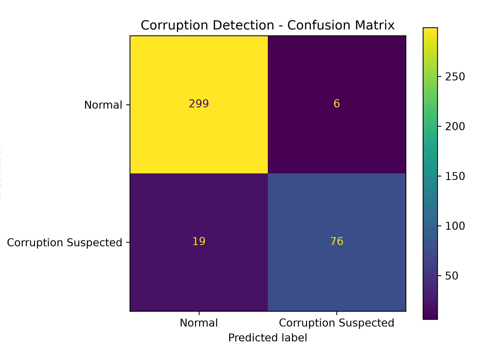
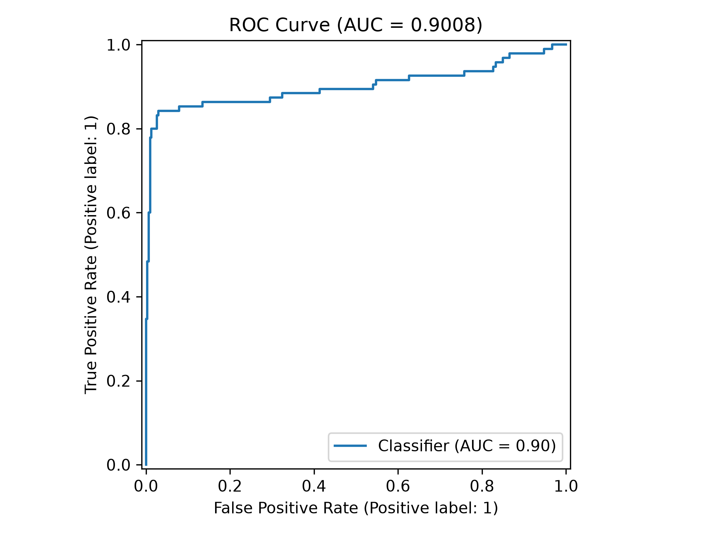
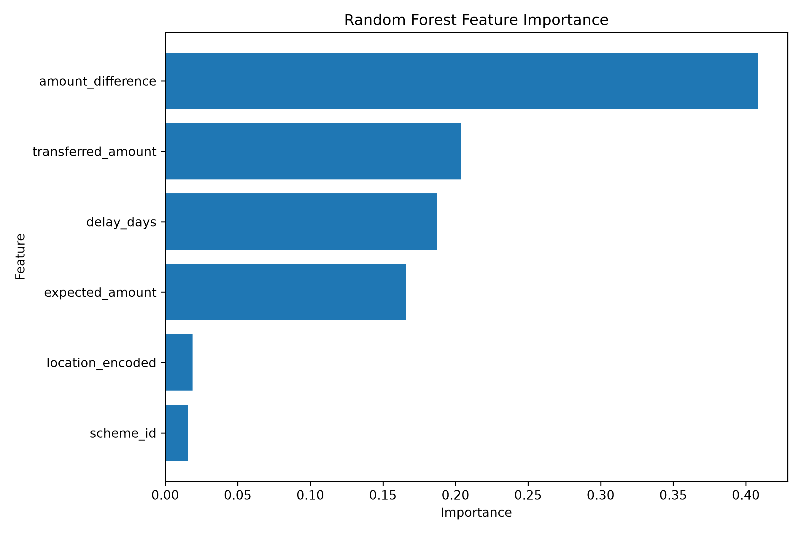

# AI-Powered Corruption Detection in Government Transactions

A Flask-based web application that uses a **Random Forest machine learning model** to identify potentially suspicious government transactions and estimate their corruption risk.

> ⚠️ **Prototype Disclaimer:** This project is a prototype. The current machine learning model is trained and evaluated using synthetically generated transaction data. Therefore, the reported evaluation metrics should not be interpreted as real-world corruption-detection accuracy.

---

## 📌 Overview

Government financial transactions can contain unusual patterns such as excessive payments, delayed transactions, or significant differences between allocated and actual amounts.

This project provides a prototype system that analyzes transaction data and assigns a **corruption-risk probability** to help identify potentially suspicious transactions.

The system combines:

- **Machine Learning** for transaction risk prediction
- **Flask** for the web application
- **SQLite + SQLAlchemy** for data management
- **Dashboard visualizations** for monitoring transactions
- **Automated model evaluation** for assessing ML performance

---

## 🚀 Key Features

### 🔐 Authentication
- User login and registration
- Session-based authentication
- Protected application routes

### 🏛️ Government Scheme Management
- Add government schemes
- View scheme details
- Track allocated and spent amounts

### 💰 Transaction Management
- Record government transactions
- Store transaction details
- Associate transactions with government schemes
- Display transaction history

### 🤖 AI-Based Corruption Detection
- Predict corruption risk for transactions
- Generate corruption probability
- Classify transactions as:
  - **Normal**
  - **Corruption Detected**

### 📊 Dashboard
- Transaction statistics
- Corruption-risk summaries
- Visual representation of transaction information

### 📈 Machine Learning Evaluation
The project automatically generates:

- Confusion Matrix
- ROC Curve
- Feature Importance visualization
- Classification Report
- Accuracy
- ROC-AUC score

---

## 🧠 Machine Learning

The system uses a **Random Forest Classifier** to predict whether a transaction may exhibit suspicious characteristics.

### Input Features

The model considers transaction-related features such as:

| Feature | Description |
|---|---|
| Transaction Amount | Amount involved in the transaction |
| Allocated Amount | Amount allocated for the scheme |
| Amount Difference | Difference between allocated and transaction amount |
| Transaction Delay | Delay associated with the transaction |
| Location | Geographic/location information |
| Large Transaction Indicator | Indicates unusually large transactions |
| Amount + Delay Interaction | Combined risk pattern |

### Training Pipeline

```text
Synthetic Transaction Data
          ↓
Feature Engineering
          ↓
Risk Pattern Generation
          ↓
Train / Test Split
          ↓
Random Forest Classifier
          ↓
Model Evaluation
          ↓
Trained Model
```

The trained model is stored at:

```text
models/corruption_model.pkl
```

---

## 📈 Model Evaluation

The training pipeline generates evaluation metrics and visualizations to assess model performance.

### Confusion Matrix



### ROC Curve



### Feature Importance



> **Note:** Since the model is trained using synthetic data, these evaluation results demonstrate the behavior of the prototype model and should not be considered evidence of real-world corruption-detection performance.

---

## 🛠️ Technology Stack

### Backend
- Python
- Flask
- Flask-SQLAlchemy
- SQLAlchemy

### Machine Learning
- Scikit-learn
- Random Forest
- Pandas
- NumPy

### Data Visualization
- Matplotlib
- Chart.js

### Database
- SQLite

### Frontend
- HTML
- CSS
- JavaScript

---

## 📂 Project Structure

```text
Corruption-detection-in-Government-Office/
│
├── evaluation/
│   ├── confusion_matrix.png
│   ├── feature_importance.png
│   └── roc_curve.png
│
├── models/
│   └── corruption_model.pkl
│
├── static/
│   └── css/
│       └── style.css
│
├── templates/
│   ├── login.html
│   ├── register.html
│   ├── dashboard.html
│   ├── schemes.html
│   ├── transactions.html
│   └── ...
│
├── .gitignore
├── .gitattributes
├── README.md
├── app.py
├── database.db
├── model_training.py
├── requirements.txt
└── seed_data.py
```

---

## ⚙️ Installation

### 1. Clone the repository

```bash
git clone https://github.com/rudra-ashrith/Corruption-detection-in-Government-Office.git
cd Corruption-detection-in-Government-Office
```

### 2. Create a virtual environment

```bash
python -m venv venv
```

Activate it on Windows:

```bash
venv\Scripts\activate
```

### 3. Install dependencies

```bash
pip install -r requirements.txt
```

---

## 🧪 Train the Machine Learning Model

To train the Random Forest model and generate evaluation results:

```bash
python model_training.py
```

This creates:

```text
models/corruption_model.pkl
```

and generates:

```text
evaluation/
├── confusion_matrix.png
├── feature_importance.png
└── roc_curve.png
```

---

## 🌱 Seed Sample Data

To populate the application with sample government schemes and transactions:

```bash
python seed_data.py
```

> The seed data is intended for demonstration and testing purposes.

---

## ▶️ Run the Application

Start the Flask application:

```bash
python app.py
```

Then open:

```text
http://127.0.0.1:5000/
```

in your browser.

---

## 🔍 How Corruption Detection Works

When a transaction is submitted:

```text
Transaction
     ↓
Feature Extraction
     ↓
Amount Difference Calculation
     ↓
Location Encoding
     ↓
Random Forest Model
     ↓
Corruption Probability
     ↓
Risk Classification
```

The system uses the predicted probability to classify transactions into different risk levels.

---

## ⚠️ Limitations

This project is currently a **prototype** and has several limitations:

- The training dataset is synthetically generated.
- Synthetic patterns may not accurately represent real-world corruption.
- The model's performance may differ significantly on real government transaction data.
- Location encoding is based on the locations available during model training.
- The system should not be used as the sole basis for real-world investigations or decisions.

---

## 🔮 Future Improvements

Possible future enhancements include:

- Training with verified real-world transaction datasets
- Advanced anomaly-detection algorithms
- Explainable AI for individual predictions
- Real-time transaction monitoring
- Improved geographic and temporal analysis
- Role-based administrative access
- Automated alerts for high-risk transactions
- Advanced dashboard analytics
- Deployment using a production database
- Model retraining and monitoring pipeline

---

## 🎯 Project Objective

The primary objective of this project is to demonstrate how **machine learning and web technologies can be combined to analyze government transaction data and identify potentially suspicious financial patterns**.

The system is intended as an academic and technical prototype for exploring AI-assisted corruption-risk detection.

---

## 👨‍💻 Project

**AI-Powered Corruption Detection in Government Transactions**

Developed as an academic project using Python, Flask, SQLite, and Machine Learning.

---

## 📄 License

This project is intended for **educational and academic purposes**.